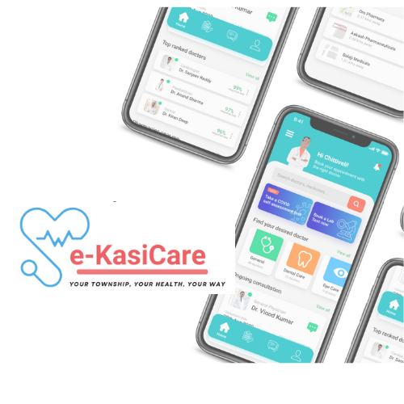
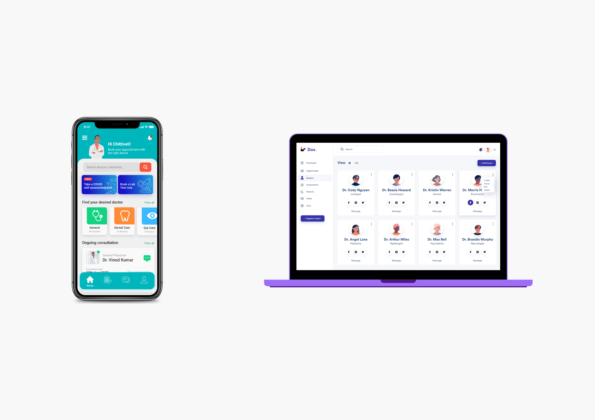
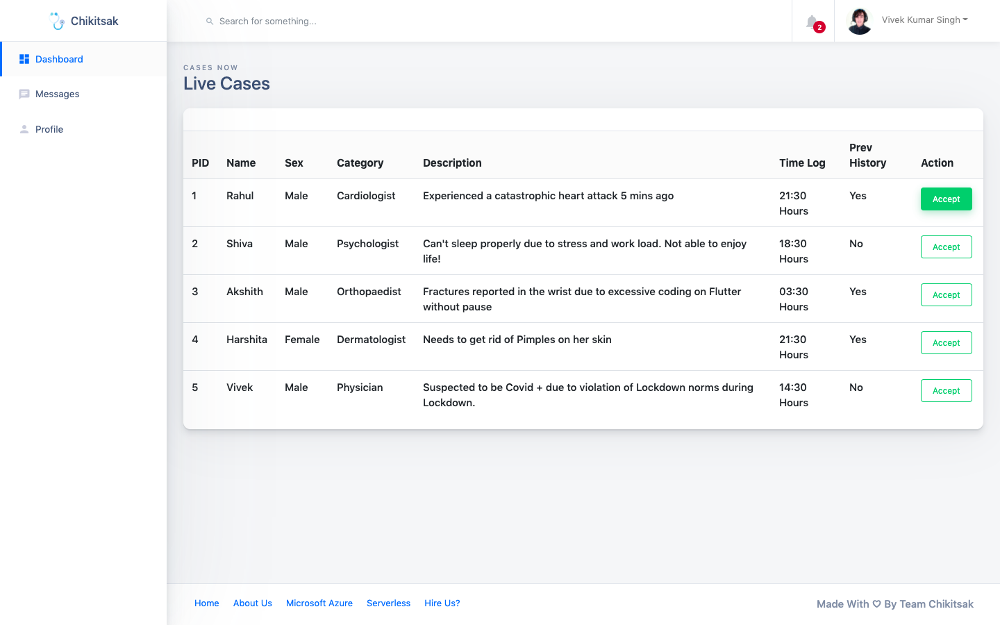
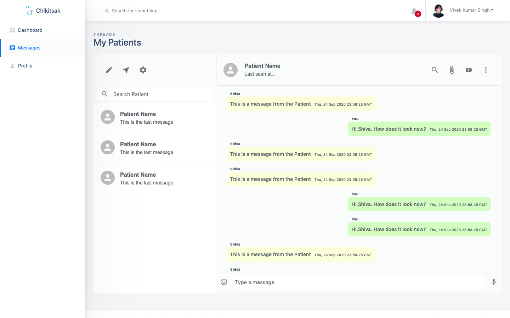
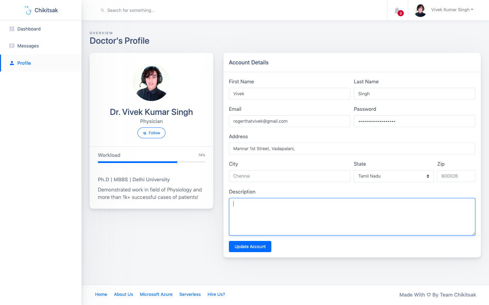

  

<h1 align="center">e-KasiCare  #JCI Durban Smart Cities (Hackathon)</h1>

---

## 🩺 About

**e-KasiCare** is a telemedicine and patient management solution designed for townships and rural communities. Built using **Azure services** and **serverless architecture**, it is a scalable, low-cost, secure healthcare platform that works across geographic locations.

The platform provides patients with a **Live Doctor Interface**, allows secure communication, appointment scheduling, and personal medical data tracking—all through mobile and web interfaces.

---

## 🚀 Features

1. **Smart Patient Interface**  
   - Book appointments, consult doctors online, and view medical history from any device.
   - Access health services across clinics and provinces with a unified medical ID.

2. **Serverless Architecture**  
   - Focus on privacy and minimal cost.
   - Passwords and sensitive data are secured with no third-party leaks.
   - Highly scalable, low-maintenance, and designed to serve large communities.

3. **No Cost Barrier**  
   - Free for students using Azure Student Accounts.
   - Very affordable for general users with pay-as-you-go Azure access.

4. **Mobile-first & Community-ready**  
   - Built to be used in low-connectivity areas.
   - Shared device support for multiple family members.
   - Supports clinics, mobile health units, and community healthcare workers.

---

## 📊 Data Analytics & Government Value

  

e-KasiCare generates structured health data that can be leveraged by governments and NGOs for:

- **Outbreak Prevention & Response**  
  Real-time tracking of symptoms and clinic visits can signal early outbreaks, enabling faster mobilization of healthcare resources.

- **Predictive Payment Systems**  
  For patients receiving grants for TB, HIV, or chronic conditions, governments can use the data to predict and validate payment schedules.

- **National Health Record Integration**  
  As patients move from one area to another, their medical records follow them—creating continuity of care across clinics and provinces.

- **Resource Planning & Budgeting**  
  Use trends in diagnoses and patient loads to forecast future needs in medication, staffing, and mobile clinics.

- **NGO/Private Sector Collaboration**  
  Anonymized data enables partnerships and interventions tailored to local health needs and behaviors.

---

## 📁 Screenshots

---

## 🛠️ Built With

- React.js / HTML / CSS / JavaScript
- Azure Functions & Blob Storage
- Firebase Auth (for secure login)
- Serverless Architecture
- Mobile-first UX for rural deployment

  

---

---

## 🙌 Acknowledgements

Special thanks to:

- **JCI Durban Smart Cities Hackathon**  
- Community healthcare workers for inspiration and feedback  
- Patients and families in underserved areas

---

## 📫 Contact

Built by [@faneleedison-ux](https://github.com/faneleedison-ux)  
For partnerships, deployments, or demos: **fanelesibongembuyazi0@gmail.com**

	
## Team Name: e-KasiCare

