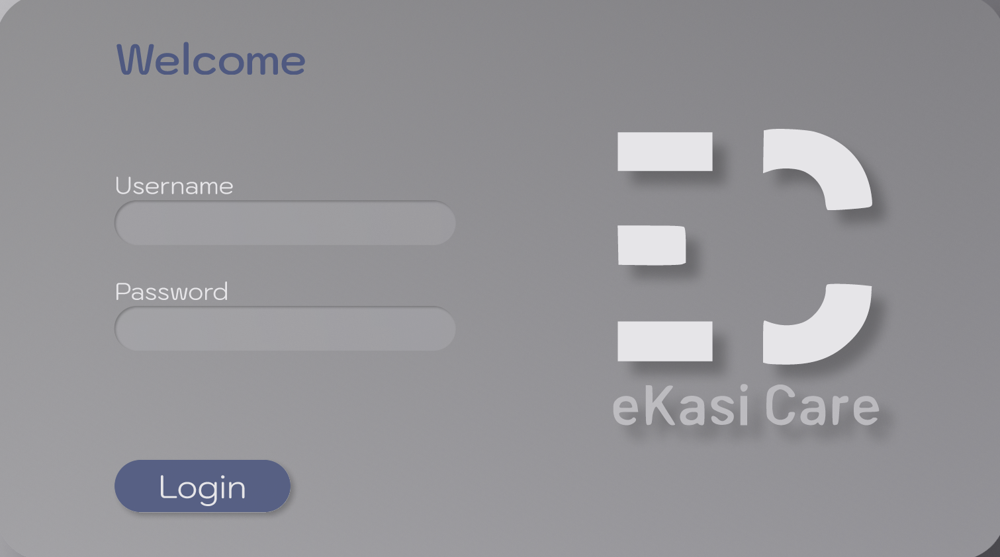
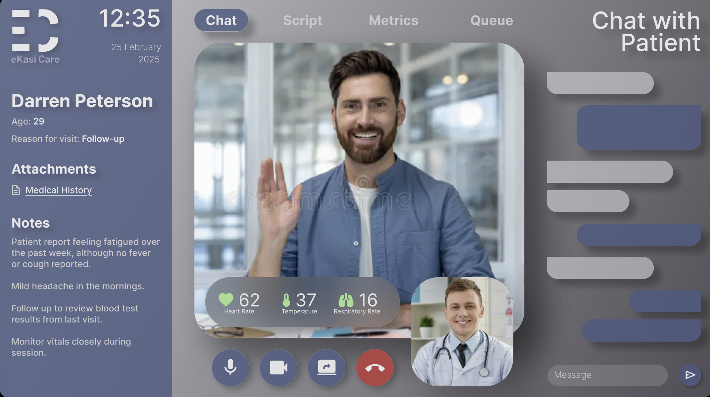

# E-Kasi Care  

**Virtual Consultation Solution powered by AI and 5G**  

E-Kasi Care is an innovative telehealth platform developed as part of the **2024 Huawei Tech4Good Global** challenge. It connects rural South Africans with urban healthcare professionals through **virtual consultations**, addressing the critical doctor-to-patient ratio of **1:3000** in underserved areas.  

By integrating **real-time health metrics** — including **heart rate, body temperature, and respiratory rate** — E-Kasi Care empowers healthcare providers to make accurate, remote diagnoses and deliver timely care.  

---

## 🎥 Demo Video  

  

---

## 📺 UI Screenshots  

### Login Screen  
  

### Video Call Screen  
  

---

## 🌍 Problem Statement  
Millions of South Africans in rural communities lack access to timely healthcare due to limited infrastructure, long travel distances, and a shortage of medical professionals. The current doctor-to-patient ratio (1:3000) highlights the urgent need for **scalable, technology-driven solutions**.  

---

## 💡 Our Solution  
E-Kasi Care leverages:  
- **AI** for intelligent health analysis and diagnosis support  
- **5G connectivity** to enable seamless, low-latency video consultations  
- **IoT-powered devices** to capture and transmit vital signs in real time  

This ensures **equitable healthcare access** for patients regardless of geography, enabling medical professionals to reach communities that were previously underserved.  

---

## 🚀 Features  
- 🧑‍⚕️ **Virtual Consultations**: Connect patients in rural areas with qualified urban doctors  
- 📊 **Real-Time Health Metrics**: Heart rate, temperature, and respiratory rate monitoring  
- ⚡ **Low-Latency 5G**: Smooth video calls and reliable data transmission  
- 🤖 **AI Assistance**: Supports doctors with data-driven insights  
- 🌐 **Scalable Platform**: Designed for nationwide deployment  

---

## 🎯 Impact & Alignment  
E-Kasi Care is directly aligned with **UN Sustainable Development Goal 3: Good Health & Well-being**.  

- 🌍 Improves **healthcare accessibility** in rural South Africa  
- 🏥 Reduces patient waiting times and unnecessary travel  
- 📈 Enables **scalable adoption** across the continent  

With the support of **Minister Solly Malatsi, Minister of Communications and Digital Technologies**, E-Kasi Care is expanding across South Africa to bring equitable healthcare access to underserved communities.  

---

## 🛠️ Tech Stack  
- **Frontend**: React.js  
- **Backend**: Spring Boot / Node.js  
- **AI/ML**: TensorFlow / PyTorch models for health analysis  
- **Cloud & Infrastructure**: Huawei Cloud, Docker, Kubernetes  
- **Connectivity**: 5G for seamless real-time communication  
- **IoT Devices**: Sensors for vital signs monitoring  

---

## 📢 Media & Resources  

- 📑 **Press Coverage**: [TechFinancials — How South Africa’s Seeds for the Future Team Won Its Place in the 2025 Finals of the Huawei Tech4Good Competition](https://techfinancials.co.za/2025/01/23/how-south-africas-seeds-for-the-future-team-won-its-place-in-the-2025-finals-of-the-huawei-tech4good-competition/)  

- 🎤 **Pitch Deck**: [View E-Kasi Care Canva Slides](https://www.canva.com/design/DAGzVYy2t6s/GRd5Y1DhEEfwxUx2wcwyCg/edit)  

---

## 📢 Acknowledgements  
- **Huawei Tech4Good Global 2024** for providing the platform to innovate  
- **Minister Solly Malatsi** for supporting the rollout of E-Kasi Care  
- All healthcare professionals and team members who contributed to this project  

---

## 🤝 Contributing  
We welcome contributions from developers, healthcare practitioners, and researchers. Please open an issue or submit a pull request to get involved.  

---

## 📜 License  
This project is licensed under the [MIT License](LICENSE).  

---

✨ *E-Kasi Care — Bridging the healthcare gap, one community at a time.*  
